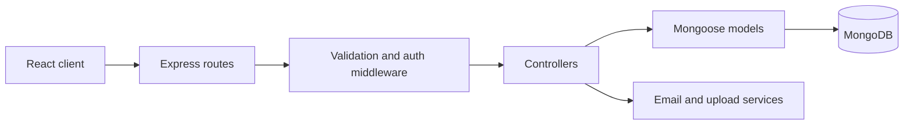

<div align="center">

# Library Management System — API

An Express and MongoDB API for authentication, catalogue management, borrowing, returns, and reader reviews.

</div>


## Overview

This repository contains the backend for the Library Management System. It exposes REST endpoints for the public catalogue and authenticated member workflows, with administrator middleware protecting inventory and library-wide circulation operations. The companion web application is available in [Frontend-LMS](https://github.com/SudanBasnet/Frontend-LMS).

## Features

- Password registration, email activation, login, logout, and password reset
- Google ID-token verification and automatic account linking by verified email
- Short-lived access JWTs backed by server-side session records
- Public and administrator book endpoints with image uploads
- Member borrowing, due-date tracking, and book returns
- Public reviews and administrator review moderation
- Joi request validation, role-aware middleware, and consistent API responses
- MongoDB models for users, books, sessions, borrowing history, and reviews

## Technology

- Node.js and Express 5
- MongoDB and Mongoose
- JSON Web Tokens and bcrypt
- Google Auth Library
- Joi validation
- Multer file uploads
- Nodemailer email delivery

## Request flow



## Project structure

```text
src/
├── config/          Database configuration
├── controllers/     Authentication, book, borrow, and review logic
├── middleware/      Authentication, validation, responses, and errors
├── models/          Mongoose schemas and data-access helpers
├── routes/          REST endpoint definitions
├── seeds/           Development book catalogue data
├── services/        Email delivery and templates
└── utils/           JWT, hashing, uploads, and shared utilities
```

## Getting started

### Prerequisites

- Node.js 20+
- Yarn
- MongoDB running locally or an accessible MongoDB connection string
- SMTP credentials for activation and password-reset emails

### Installation

```bash
git clone https://github.com/SudanBasnet/Backend-LMS.git
cd Backend-LMS
yarn install
cp .env.example .env
```

Configure `.env`:

```env
PORT_URI=8080
ROOT_URL=http://localhost:5173
MONGO_URL=mongodb://127.0.0.1:27017/full-stack-lms

ACCESSJWT_SECRET=replace-with-a-long-random-secret
REFRESHJWT_SECRET=replace-with-another-long-random-secret

GOOGLE_CLIENT_ID=your-google-web-client-id.apps.googleusercontent.com

SMTP_HOST=smtp.example.com
SMTP_PORT=587
SMTP_EMAIL=your-smtp-email
SMTP_PASS=your-smtp-password
```

Start the API:

```bash
yarn dev
```

The server runs at `http://localhost:8080` by default. A successful `GET /` request returns the server status.

## Environment variables

| Variable | Purpose |
| --- | --- |
| `PORT_URI` | API port |
| `ROOT_URL` | Frontend origin used in activation links |
| `MONGO_URL` | MongoDB connection string |
| `ACCESSJWT_SECRET` | Access-token signing secret |
| `REFRESHJWT_SECRET` | Refresh-token signing secret |
| `GOOGLE_CLIENT_ID` | Audience used to verify Google ID tokens |
| `SMTP_HOST`, `SMTP_PORT` | SMTP server configuration |
| `SMTP_EMAIL`, `SMTP_PASS` | SMTP account credentials |

Keep the real `.env` file out of Git. A Google Client Secret is not required for the implemented Google ID-token flow.

## API endpoints

All routes are prefixed with `/api/v1`.

### Authentication and users

| Method | Endpoint | Access | Purpose |
| --- | --- | --- | --- |
| `POST` | `/auth/register` | Public | Register with email and password |
| `POST` | `/auth/activate-user` | Public | Activate an email account |
| `POST` | `/auth/login` | Public | Password login |
| `POST` | `/auth/google` | Public | Verify Google credential and issue LMS tokens |
| `GET` | `/auth/renew-jwt` | Refresh token | Renew the access token |
| `GET` | `/auth/logout` | Member | Revoke the current LMS session |
| `POST` | `/auth/otp` | Public | Request a password-reset OTP |
| `POST` | `/auth/reset-password` | Public | Reset a password using an OTP |
| `GET` | `/user/profile` | Member | Return the current safe user profile |

### Books, borrowing, and reviews

| Method | Endpoint | Access | Purpose |
| --- | --- | --- | --- |
| `GET` | `/books` | Public | List active catalogue books |
| `GET` | `/books/public/:slug` | Public | Get one public book |
| `GET` | `/books/admin` | Admin | List books for administration |
| `POST` | `/books` | Admin | Create a book with an image |
| `PUT` | `/books` | Admin | Update a book and its images |
| `DELETE` | `/books/:id` | Admin | Delete a book |
| `POST` | `/borrows` | Member | Borrow selected books |
| `GET` | `/borrows/user` | Member | Get the member's borrowing history |
| `GET` | `/borrows/admin` | Admin | Get all borrowing history |
| `PATCH` | `/borrows` | Member | Return a borrowed book |
| `GET` | `/reviews` | Public | List public reviews |
| `POST` | `/reviews` | Member | Submit a review |
| `GET` | `/reviews/admin` | Member/Admin | List reviews for management |
| `PATCH` | `/reviews/admin` | Member/Admin | Update review status |

Protected requests use the following header:

```http
Authorization: Bearer <accessJWT>
```

## Authentication and stored data

After password or Google authentication, the API issues the same LMS token pair:

- The access JWT is stored in the `Session` collection and expires after 15 minutes.
- The refresh JWT is associated with the user record.
- Google-only accounts store no password.
- Existing password accounts retain their bcrypt hash when Google is linked.
- The Google ID credential is verified but not stored.
- Profile responses remove `password`, `refreshJWT`, and `googleId`.

## File uploads

Book images are written under `public/` and served by Express as static files. That directory is intentionally ignored by Git, so production deployments should use persistent storage or an external object-storage provider.

## Development data and API testing

Seed the development catalogue:

```bash
yarn import-book
```

The tracked `rest.http` file contains example requests for authentication, books, borrowing, returns, and reviews. Update its variables and tokens before sending protected requests.

## Scripts

| Command | Description |
| --- | --- |
| `yarn dev` | Start the API with Nodemon |
| `yarn start` | Start the API with Node |
| `yarn import-book` | Import development book data |

## Related repository

- [Frontend-LMS](https://github.com/SudanBasnet/Frontend-LMS) — React interface for public, member, and administrator workflows
